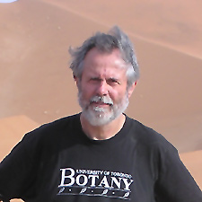

University Professor

Department of Ecology and Evolutionary Biology  
University of Toronto  
25 Willcocks Street  
Toronto, Ontario, Canada  
M5S 3B2  

Phone: [416-978-4151](tel:416-978-4151)  
Email: [spencer.barrett@utoronto.ca](mailto:spencer.barrett@utoronto.ca)

## Degrees
	

- B. Sc. (Honours)                 Department of Agricultural Botany, University of Reading, England 1967-71

- Ph. D.                                Department of Botany, University of California, Berkeley, U.S.A. 1972-77
 Current Position

- University Professor, University of Toronto, 2008
- Canada Research Chair - Evolutionary Genetics Tier 1 2001-08, 2008-14
- Professor, University of Toronto. Tenure granted 1982, Full Professor 1986

## Research Interests

- _General:_ plant evolutionary biology, ecological & evolutionary genetics, evolutionary ecology, comparative biology & phylogeny reconstruction, plant barcoding, conservation biology, plants & human affairs

- _Specific:_ evolution & ecology of plant mating systems, pollination biology, floral evolution, gender strategies, sexual dimorphism and sex ratios, evolution of selfing & outcrossing, biology of invading plants, colonization genetics, genetics & ecology of small populations, metapopulation biology, evolution on islands, systematics & evolution of aquatic plants 

## National & International Experience

- President, Canadian Society for Ecology and Evolution, 2010-2012

- Vice President (North America), Society for the Study of Evolution, 2010-2012

- Visiting Professor, University of Chile, Santiago, 2010

- Visiting Professor, University of Stellenbosch, South Africa, 2009

- Vice President, Canadian Society for Ecology & Evolution, 2008-9

- Adjunct Professor, Washington State University, Pullman, 2006-7

- Council Member, European Society for Evolutionary Biology, 2005

- Adjunct Professor, Xishuangbanna Tropical Botanical Garden, Chinese Academy of Sciences, Menglun China, 2004-6

- International Panel Member, Deutsche Forschungsgemeinschaft Priority Programme "Radiations - Origins of Biological Diversity", Germany 2002-7

- Member, "Expert Panel on the Future of Food Biotechnology." Royal Society of Canada, 2000-1

- Member, "Committee on the Scientific Basis for Predicting the Invasive Potential of Non-indigenous Plants & Plant Pests in the USA." National Academy of Sciences & National Research Council, USA. 1999-2001

- Member, External Review Committee, Department of Biology, University of Victoria, 1999

- Programme Committee, XVI International Botanical Congress, St. Louis, USA, 1999

- External Assessor, 1999 Crafoord Prize in Biosciences, Royal Swedish Academy of Sciences

- Visiting Mellon Scholar, Rancho Santa Ana Botanic Garden, California, USA, 1997

- Member, International Committee of Experts review of "Swedish Research in Biology" for the Swedish Natural Science Research Council, 1994-1995

- Visiting Professor, Department of Botany, University of Hong Kong, 1994

- Research Associate, Royal Ontario Museum, Department of Botany 1992 - present

- Member, Faculty of Science Review Committee for the Department of Botany, University of British Columbia, 1989

- Chair & Panel Member, Natural Sciences & Engineering Research Council of Canada, Grant Selection Committee in Population Biology, 1984-88

- Visiting Research Scientist, Genetic Resources Programme, Division of Plant Industry, CSIRO, Canberra, Australia, 1983-84

- Aquatic Weed Consultant, International Research Institute, Jari, Lower Amazon, Brazil, 1974

- Weed Biologist, Commonwealth Development Corporation, Swaziland Irrigation Scheme, 1969-70

## Honours & Awards

- Flavelle Medal, Royal Society of Canada, Canada, 2015

- Extraordinary Professor, University of Stellenbosch, South Africa, 2010

- Foreign Honorary Member, American Academy of Arts and Sciences, 2009

- William Evans Visiting Fellow, Department of Botany, University of Otago, New Zealand, 2009

- University Professor, University of Toronto, 2008

- Canada Research Chair, Evolutionary Genetics Tier 1 (renewal), 2008

- Sewall Wright Award, American Society of Naturalists , 2008

- Premier’s Discovery Award for Life Sciences & Medicine, Ontario Government, 2007

- Lawson Medal, Canadian Botanical Association, 2006

- Centennial Award, Botanical Society of America, 2006

- Fellow of the Royal Society of London, 2004

- Merit Award Botanical Society of America, 2003

- Canada Research Chair, 2001

- Fellow of the Royal Society of Canada, 1998

- Natural Sciences & Enginering Research Council of Canada, E.W. Steacie Memorial Fellowship, 1988-90

- Outstanding Teaching Award, Faculty of Arts & Sciences, University Toronto, 1992-93.

## Editorial & Advisory Boards

- Present: Editor-in-Chief, Proceeding of the Royal Society of London Series B, Journal of Systematics and Evolution, New Phytologist, Trends in Ecology & Evolution

- Past: Evolution, Philosophical Transactions of the Royal Society of London Series B., International Journal of Plant Sciences, Evolutionary Applications, Molecular Ecology, Journal of Ecology, Journal of Evolutionary Biology, Plant Species Biology, American Journal of Botany, Proceedings of the Royal Society of London Series B (Editor)

